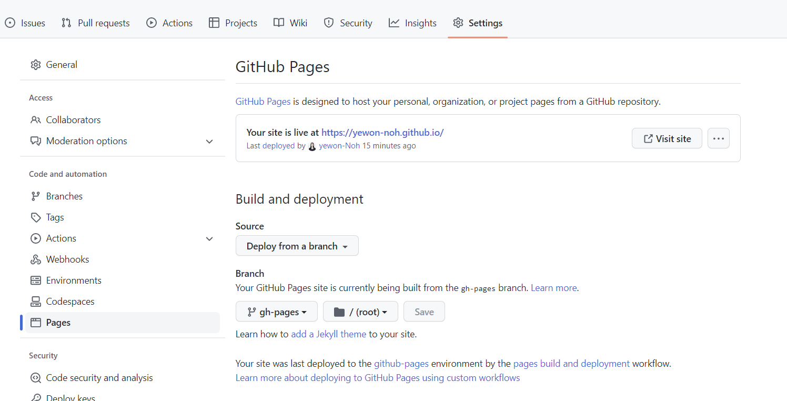
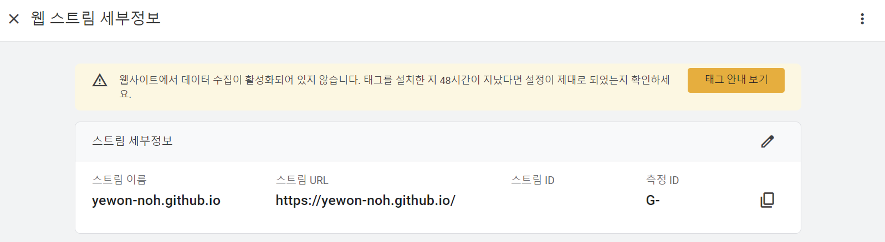

Tistory, Velog를 거쳐 Github 블로그로 오게 되었다.

Gatsby로 개발된 테마를 사용하였으며 개설하는 방법을 작성하였다.

<br/>

# 1. Gatsby를 선택한 이유

Github 블로그를 만들 때 주로 Jekyll와 Gatsby를 사용한다.

Jekyll은 Rudy 언어로, Gatsby는 React를 기반으로 만들어졌다.

평소에 React에 관심이 있었기 때문에 Gatsby를 선택하게 되었다.

<br/>

# 2. Gatsby 및 테마 설치하기

Gatsby CLI를 설치해야 한다.

```
npm install -g gatsby-cli
```

원하는 테마를 골라 새 Gatsby 사이트를 만든다.

```
// gatsby new [이름] [테마 URL]
gatsby new portfolio-minimal https://github.com/konstantinmuenster/gatsby-starter-portfolio-minimal-theme
```

설치 도중 아래와 같은 오류가 발생한다면 참고할 수 있다.

> ⚠️ gyp verb check python checking for Python executable "python2" in the PATH
>
> 원인 : Nodejs 설치 시 파이썬 등 필수 요소가 자동적으로 설치되어야 하는데 실패하여 Python이 설치되지 않았음.
>
> 해결 방법 : default 경로인 C:\Python27에 Python 2.7을 설치한다.
>
> ⚠️ gyp err! stack error: c:\\windows\\microsoft.net\\framewaork\\v4.0.30319\\msbuild.exe failed with exit code: 1
>
> 원인 : node-sass와 sass-loader 버전이 충돌하였음.
>
> 해결 방법 :
>
> 1. npm uninstall node-sass
>
> 2. npm install node-sass 혹은 yarn add node-sass
>
> 3. 프로젝트 내의 node_modules 폴더, yarn.lock, package-lock.json 삭제
>
> 4. yarn install 혹은 npm install 재설치

<br/>

# 3. Gatsby 실행하기

gatsby develop를 통해 실행할 수 있다.

```
cd portfolio-minimal
gatsby develop
# open localhost:8000
```

<br/>

# 4. Github Pages를 통해 배포하기

Gatsby 테마를 GitHub 페이지에 올리기 위해 gh-pages라는 패키지를 설치해야 한다.

```
npm install gh-pages --save-dev
```

설치한 후 package.json에 설정을 추가해준다.

```
{
  "scripts": {
    "deploy": "gatsby build && gh-pages -d public" // 추가
  }
}
```

npm run deploy를 통해 Github Pages에 배포할 수 있다.

좀 기다린 후에 Published 라는 메시지를 받았다면 배포가 완료된 것이다.

```
npm run deploy
```

마지막으로 GitHub 페이지가 작동하려면 Repository Source Branch를 변경해야 한다.

GitHub의 Repository 설정에서 배포 할 Branch(여기서는 gh-pages)를 선택한다.



# 5. Google Analytics 연결하여 방문자 수 구하기

블로그를 시작하면 방문자 수를 확인하고 싶다.

이럴땐 구글에서 제공하는 Google Analytics를 이용하여 방문자 수를 구할 수 있다.

Gatsby에서 제공하는 플러그인 gatsby-plugin-google-gtag 을 설치해준다.

> ⚠️ gatsby-plugin-google-analytics도 있지만 더 이상 지원하지 않는다.

```
npm install gatsby-plugin-google-gtag
```

그 다음 gatsby-config.js 파일에 설정을 추가해준다.

```javascript
module.exports = {
  plugins: [
    ...{
      resolve: `gatsby-plugin-google-gtag`,
      options: {
        // You can add multiple tracking ids and a pageview event will be fired for all of them.
        trackingIds: [
          "G-XXXXXXXXX", // Google Analytics / GA
        ],
      },
    },
  ],
};
```

여기서 GA-TRACKING_ID은 Google Analytics에서 설정한 스트림 측정 ID 값이다.



여기까지 설정이 끝나면 Google Analytics 홈에서 결과를 확인할 수 있다.

---

**참고**

- [Gatsby Theme Portfolio Minimal](https://github.com/konstantinmuenster/gatsby-theme-portfolio-minimal/tree/main/gatsby-theme-portfolio-minimal#using-the-content-directory)

- [Gatsby 블로그 적용 도중 만난 에러](https://kmkmi.github.io/Gatsby%20%EB%B8%94%EB%A1%9C%EA%B7%B8%20%EC%A0%81%EC%9A%A9%20%EB%8F%84%EC%A4%91%20%EB%A7%8C%EB%82%9C%20%EC%97%90%EB%9F%AC/)

- [최신버전 깔았을시 이런 에러가 떠요](https://codingapple.com/forums/topic/%EC%B5%9C%EC%8B%A0%EB%B2%84%EC%A0%84-%EA%B9%94%EC%95%98%EC%9D%84%EC%8B%9C-%EC%9D%B4%EB%9F%B0-%EC%97%90%EB%9F%AC%EA%B0%80-%EB%96%A0%EC%9A%94/)

- [Gatsby 테마로 GitHub Blog 만들기](https://www.zoomkoding.com/gatsby-github-blog/)
